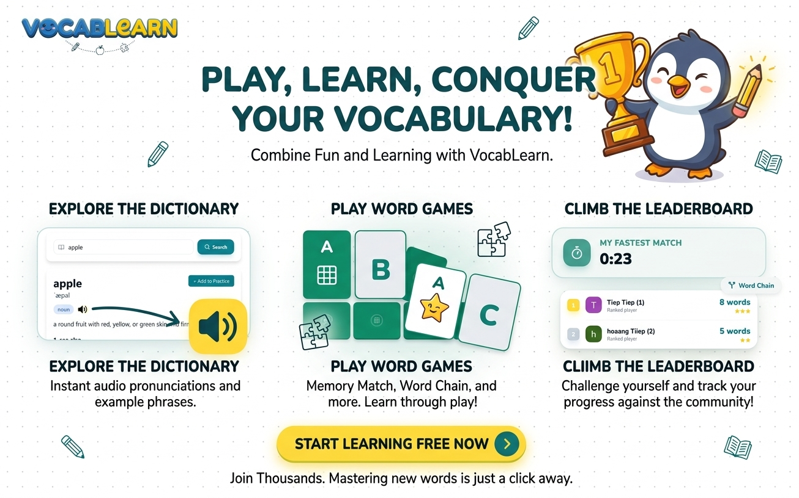

# Vocabplay

Vocabplay is an interactive vocabulary learning application built to help users expand their word knowledge through active practice and memorization.

## 🚀 Features

- **Personalized Vocabulary Management**: Easily add and organize words you want to learn.
- **Interactive Games**:
    - **Memory Match**: Test your recall with a classic card-matching game.
    - **Word Chain**: Challenge yourself with a fast-paced word-linking game.
- **Interactive Flashcards**: Practice with a dynamic "FlipCard" component for enhanced memorization.
- **Memorization Tracking**: Track your progress with a built-in memorization status for each word.
- **Seamless Authentication**: Secure login and session management powered by **Clerk**.
- **Responsive Design**: A premium, mobile-friendly UI built with **Tailwind CSS** and **Radix UI**.

## 🛠️ Tech Stack

### Frontend
- **React 19** - Modern UI library
- **Vite** - Lightning-fast build tool
- **TypeScript** - Type-safe development
- **Tailwind CSS** - Utility-first styling
- **Lucide React** - Beautifully simple icons
- **React Router** - Client-side routing

### Backend
- **Node.js & Express** - Scalable server-side logic
- **Prisma** - Next-generation ORM for PostgreSQL
- **PostgreSQL** - Reliable relational database
- **JWT Authentication** - Secure authentication on the server
- **Svix** - Webhook handling

## 📄 License

This project is licensed under the MIT License - see the [LICENSE](LICENSE) file for details.
